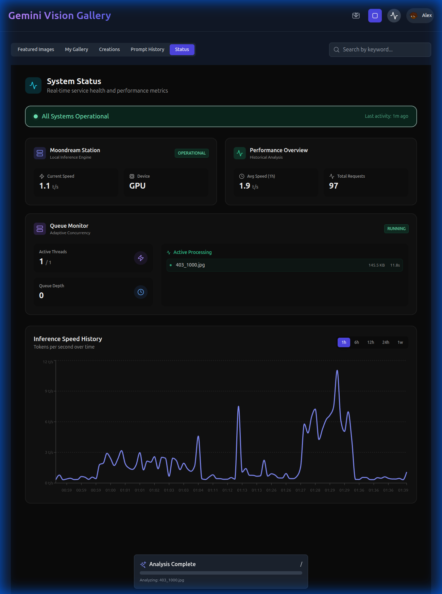
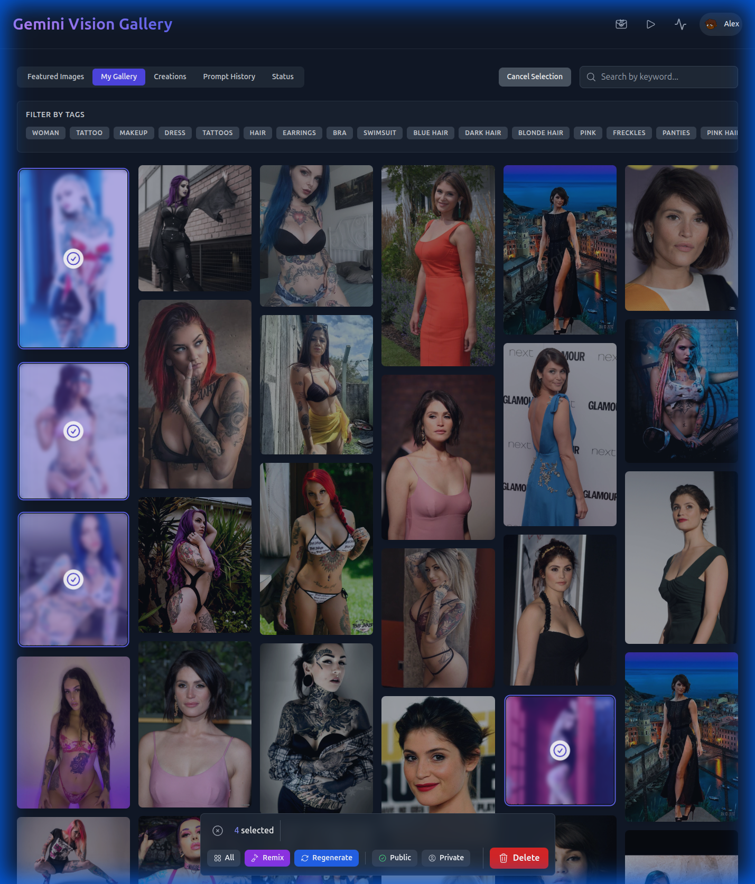

# Image Gallery 2

A modern, AI-powered image gallery application built with React, Vite, and Moondream. This application allows users to upload, organize, and analyze images using local AI models for captioning and tagging.


## Purpose

The goal of Image Gallery 2 is to provide a seamless and private way to manage image collections with the power of local AI. It features:
- **Local AI Analysis**: Uses Moondream to generate captions and tags for images without sending data to the cloud.
- **Adaptive Concurrency**: Dynamically adjusts AI processing load based on system performance to ensure responsiveness.
- **Real-time Monitoring**: Visualizes the AI processing queue and system resource usage.
- **Batch Processing**: Supports regenerating captions for multiple images simultaneously.

## Features

- **Smart Upload**: Automatically analyzes uploaded images for content.
- **Search & Filter**: Find images by keywords or captions.
- **Status Dashboard**: Monitor queue depth, active jobs, and processing speed.
- **Responsive Design**: Works beautifully on desktop and mobile.


## Requirements

To run this application, you need:

- **Node.js**: v18 or higher
- **Python**: v3.8 or higher (for Moondream station)
- **Moondream Station**: A local instance of the Moondream model server.

### Dependencies
- React 19
- Vite 6
- Tailwind CSS
- Recharts (for analytics)
- Lucide React (for icons)

## Installation

1.  **Clone the repository:**
    ```bash
    git clone https://github.com/bcoster22/Image-Gallery-2.git
    cd Image-Gallery-2
    ```

2.  **Install frontend dependencies:**
    ```bash
    npm install
    ```

3.  **Set up Moondream Station:**
    Ensure you have the `moondream-station` set up and running. Refer to the Moondream documentation for specific installation steps if not already configured.
    
    *Note: The application expects Moondream to be running on `http://localhost:2021`.*

## Running the Application

1.  **Start Moondream Station:**
    ```bash
    # Command may vary based on your installation
    ./moondream-station
    ```

2.  **Start the Development Server:**
    ```bash
    npm run dev
    ```

3.  **Open in Browser:**
    Navigate to `http://localhost:3000` to view the gallery.

## Usage

- **Upload Images**: Drag and drop images into the upload area.
- **View Details**: Click on an image to see its caption, tags, and metadata.
- **Regenerate Captions**: Select images and click "Regenerate" to update their AI analysis.
- **Monitor Status**: Check the "Status" page to see active jobs and queue performance.




## License

MIT
