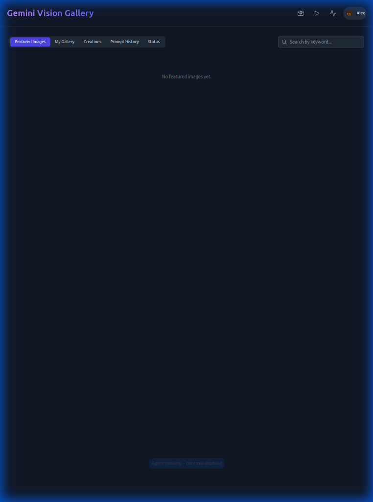

# Image Gallery 2 🎨

<div align="center">


</div>

---

A modern, AI-powered image gallery application with **local GPU acceleration** for image generation, enhancement, and analysis. Built with React, Vite, and integrated AI models (SDXL, Moondream) for privacy-focused creative workflows.

> **📢 For AI Assistants (Claude, Gemini, Cursor, etc.)**  
> Before making changes to this codebase:
> 1. Read [AI-Maintainability Framework](docs/AI_MAINTAINABILITY_FRAMEWORK.md)  
> 2. Check [CONTRIBUTING.md](CONTRIBUTING.md) for development guidelines  
> 3. Use workflows in `.agent/workflows/` for common tasks  
> 4. Run `npm run lint` before committing  
>
> **Key Rules:** Functions under 50 lines | Extract magic numbers to constants | Add TypeScript types | Test before commit



## ✨ Features

### 🤖 AI-Powered Image Processing
- **Local Image Generation**: SDXL-based models (Juggernaut Lightning, Animagine XL, DreamShaper) for photorealistic and artistic generation
- **Image Enhancement**: Upscale and restore images with AI-powered detail enhancement
- **Smart Captioning**: Automatic image analysis and tagging using Moondream vision model
- **Remix & Transform**: Convert images to sketches, change styles, or reimagine scenes

### 🖼️ Gallery Management
- **Smart Upload**: Drag-and-drop with automatic AI analysis
- **Advanced Search**: Find images by keywords, captions, or tags
- **Smart Cropping**: AI-powered subject detection for perfect thumbnails
- **Batch Processing**: Process multiple images simultaneously with adaptive concurrency

### 🎬 Slideshow & Viewing
- **Cinematic Effects**: Parallax Glide, Stack, Cube transitions with hardware acceleration
- **Adaptive Pan**: Automatic panning for horizontal images on portrait displays
- **Smart Focus**: AI-centered composition for optimal viewing
- **Video Support**: Display and manage video content alongside images

### 📊 System Monitoring
- **Real-time Queue**: Monitor AI processing jobs and throughput
- **GPU Dashboard**: Track VRAM usage, temperature, and model status
- **Performance Analytics**: Adaptive concurrency based on system load
- **Health Checks**: Automatic retry and error recovery

### 🎨 Creative Tools
- **Image-to-Image**: Transform existing images with AI guidance (Remix mode)
- **Text-to-Image**: Generate new images from scratch using existing image metadata/captions
- **Smart Remix**: Automatically extracts positive and negative prompts from AI captions or metadata
- **Style Presets**: Quick Fix, Standard, Portrait, 4K Remaster modes
- **Fine Control**: Adjust steps, CFG scale, denoising, and resolution
- **Multi-model Support**: Switch between photorealistic, anime, and artistic models

---

## 🚀 Quick Start

### Option 1: Docker Deployment (Recommended for Production)

```bash
# Clone repository
git clone https://github.com/bcoster22/Image-Gallery-2.git
cd Image-Gallery-2

# Run automated deployment
chmod +x deploy.sh
./deploy.sh
```

The script will:
- ✅ Check system prerequisites (GPU, Docker, NVIDIA toolkit)
- ✅ Install missing dependencies automatically
- ✅ Build optimized Docker images
- ✅ Configure environment variables
- ✅ Start services with GPU support
- ✅ Verify deployment health

**Access:**
- 🌐 Frontend: http://localhost (or your server IP)
- 🔌 Backend API: http://localhost:2020
- 📊 Health Check: `curl http://localhost:2020/v1/status`

---

### Option 2: Manual Setup (Development)

Perfect for development, testing, or when you need more control.

#### System Requirements

| Component | Minimum | Recommended |
|-----------|---------|-------------|
| **GPU** | NVIDIA 12GB VRAM<br>(GTX 3060, RTX 3060) | NVIDIA 16GB+ VRAM<br>(RTX 4090, A5000) |
| **RAM** | 32GB | 64GB+ |
| **Storage** | 50GB SSD | 100GB+ NVMe SSD |
| **CPU** | 4-core | 8+ cores |
| **OS** | Ubuntu 20.04+ | Ubuntu 22.04 LTS |
| **CUDA** | 11.8+ | 12.1+ |
| **Python** | 3.10+ | 3.11+ |
| **Node.js** | 18+ | 20+ LTS |

#### Step 1: Install System Dependencies

<details>
<summary><b>Ubuntu/Debian</b></summary>

```bash
# Update package list
sudo apt update && sudo apt upgrade -y

# Install build essentials
sudo apt install -y build-essential git curl wget

# Install Python 3.11
sudo apt install -y python3.11 python3.11-venv python3.11-dev

# Install Node.js 20 LTS
curl -fsSL https://deb.nodesource.com/setup_20.x | sudo -E bash -
sudo apt install -y nodejs

# Verify installations
python3.11 --version  # Should show 3.11.x
node --version        # Should show v20.x
npm --version         # Should show 10.x+
```
</details>

<details>
<summary><b>NVIDIA Drivers & CUDA (Required for GPU)</b></summary>

```bash
# Check if NVIDIA driver is installed
nvidia-smi

# If not installed, install NVIDIA drivers
sudo apt install -y nvidia-driver-535

# Install CUDA Toolkit 12.1
wget https://developer.download.nvidia.com/compute/cuda/repos/ubuntu2204/x86_64/cuda-keyring_1.0-1_all.deb
sudo dpkg -i cuda-keyring_1.0-1_all.deb
sudo apt update
sudo apt install -y cuda-12-1

# Add to PATH (add to ~/.bashrc for persistence)
export PATH=/usr/local/cuda-12.1/bin:$PATH
export LD_LIBRARY_PATH=/usr/local/cuda-12.1/lib64:$LD_LIBRARY_PATH

# Verify CUDA installation
nvcc --version
nvidia-smi
```

**Reboot after driver installation:**
```bash
sudo reboot
```
</details>

#### Step 2: Clone Repository

```bash
# Clone the repository
git clone https://github.com/bcoster22/Image-Gallery-2.git
cd Image-Gallery-2

# Verify you're in the correct directory
ls -la
# You should see: package.json, requirements.txt, docker-compose.yml, etc.
```

#### Step 3: Setup Python Backend

```bash
# Create Python virtual environment
python3.11 -m venv .venv

# Activate virtual environment
source .venv/bin/activate

# Upgrade pip
pip install --upgrade pip setuptools wheel

# Install Python dependencies
pip install -r requirements.txt

# This will install:
# - PyTorch with CUDA support (~2GB)
# - Diffusers (Stable Diffusion)
# - Transformers (Moondream)
# - FastAPI (API server)
# - bitsandbytes (4-bit quantization)
# - And many more...
```

**Expected Installation Time:** 5-15 minutes depending on your internet speed.

<details>
<summary><b>Troubleshooting Python Installation</b></summary>

**Error: "Could not find a version that satisfies the requirement torch"**
```bash
# Install PyTorch manually first
pip install torch torchvision torchaudio --index-url https://download.pytorch.org/whl/cu121
# Then retry: pip install -r requirements.txt
```

**Error: "ImportError: libcudnn.so.8"**
```bash
# Install cuDNN
sudo apt install -y libcudnn8 libcudnn8-dev
```

**Error: "No module named 'bitsandbytes'"**
```bash
# Install bitsandbytes separately
pip install bitsandbytes
```
</details>

#### Step 4: Setup Moondream Station (Backend)

**Moondream Station is THE backend** - it provides ALL AI capabilities (vision, generation, analysis).

```bash
# Create installation directory
mkdir -p ~/.moondream-station
cd ~/.moondream-station

# Clone Moondream Station
git clone https://github.com/bcoster22/moondream-station.git
cd moondream-station

# Create and activate virtual environment
python3.11 -m venv .venv
source .venv/bin/activate

# Install dependencies
pip install -r requirements.txt

# Download models (optional - auto-downloads on first use)
python -c "from transformers import AutoModel; AutoModel.from_pretrained('vikhyatk/moondream2')"
```

#### Step 5: Download AI Models

SDXL models will be auto-downloaded to moondream-station on first use, or you can pre-download them.

```bash
# Activate moondream-station environment
cd ~/.moondream-station/moondream-station
source .venv/bin/activate

# Install Hugging Face CLI (if not already installed)
pip install huggingface-hub

# Download models (optional - auto-downloads on first use)
# This will download ~20GB of models
huggingface-cli download RunDiffusion/Juggernaut-XL-Lightning
huggingface-cli download cagliostrolab/animagine-xl-3.1
huggingface-cli download Lykon/dreamshaper-xl-lightning
```

**Model Storage Location:**
- Default: `~/.moondream-station/models/`
- Set via `MOONDREAM_MODELS_DIR` environment variable

#### Step 6: Setup Frontend

```bash
# Navigate to Image-Gallery-2 directory
cd ~/path/to/Image-Gallery-2

# Install Node dependencies
npm install

# This will install:
# - React 19
# - Vite 6
# - TypeScript
# - Tailwind CSS
# - And all UI dependencies
```

**Expected Installation Time:** 2-5 minutes

#### Step 7: Configure Environment

```bash
# Copy environment template
cp .env.example .env

# Edit configuration
nano .env  # or use your preferred editor (vim, code, etc.)
```

**Minimum Configuration Required:**

```bash
# Backend Settings
PORT=2020
HOST=0.0.0.0
VRAM_MODE=balanced

# Model Paths
MOONDREAM_PATH=/home/yourusername/.moondream-station/moondream-station
MOONDREAM_MODELS_DIR=/home/yourusername/.cache/huggingface/hub

# Frontend Settings
VITE_API_BASE_URL=http://localhost:2020

# GPU Settings
CUDA_VISIBLE_DEVICES=0
```

**Optional Cloud API Keys** (for cloud providers):
```bash
VITE_GEMINI_API_KEY=your_key_here
VITE_OPENAI_API_KEY=your_key_here
VITE_GROK_API_KEY=your_key_here
```

#### Step 8: Start the Application

```bash
# Terminal 1: Start Moondream-Station Backend
cd ~/.moondream-station/moondream-station
source .venv/bin/activate
python3 start_server.py

# You should see:
# - "Moondream Station starting..."
# - "Backend loaded successfully"
# - "Uvicorn running on http://0.0.0.0:2020"

# Terminal 2: Start Frontend (new terminal)
cd ~/path/to/Image-Gallery-2
npm run dev

# You should see:
# - "VITE v6.x.x ready in X ms"
# - "Local: http://localhost:3000"
```

#### Step 9: Access the Application

1. **Open your browser:** http://localhost:3000
2. **First-time setup:**
   - Click "Sign In" (uses mock authentication)
   - Go to Settings (gear icon) to configure AI providers
   - Upload your first image to test

**🎉 Congratulations! Your development environment is ready!**

---

### Option 3: Development with Auto-Reload

For active development, you can use hot-reload for both frontend and backend:

```bash
# Terminal 1: Moondream-Station with auto-reload
cd ~/.moondream-station/moondream-station
source .venv/bin/activate
python3 -m moondream_station.core.rest_server --reload

# Terminal 2: Frontend with HMR
cd ~/path/to/Image-Gallery-2
npm run dev
```

This enables:
- ⚡ Instant frontend updates on code changes
- 🔄 Backend auto-restart on Python file modifications
- 🐛 Better debugging experience

---

## 📋 Requirements

### Minimum System
- NVIDIA GPU: 12GB VRAM (GTX 3060, RTX 3080, etc.)
- RAM: 32GB
- Storage: 50GB free
- CPU: Multi-core (4+ cores recommended)

### Recommended System
- NVIDIA GPU: 16GB+ VRAM (RTX 4090, A5000, etc.)
- RAM: 64GB
- Storage: 100GB+ NVMe SSD
- CPU: 8+ cores

### Software Stack
- **Frontend:** React 19, Vite 6, TypeScript, Tailwind CSS
- **Backend:** Python 3.11, FastAPI, PyTorch 2.x
- **AI Models:** SDXL (Stable Diffusion XL), Moondream 2
- **Runtime:** CUDA 12.1+, cuDNN 8+

---

## 🔧 Configuration

The application is configured via the Admin Settings panel (Gear icon in sidebar) and environment variables.

### AI Model Selection

**SDXL Models Available:**
- `sdxl-realism`: Juggernaut XL Lightning (photorealistic)
- `sdxl-anime`: Animagine XL 3.1 (anime/illustration)
- `sdxl-surreal`: DreamShaper Lightning (artistic/surreal)

**Vision Model:**
- `moondream-2`: Local vision analysis (7B parameters, optimized for edge devices)

### Performance Modes

**VRAM Usage:**
- `low`: 8-10GB (uses aggressive quantization)
- `balanced`: 12-14GB (recommended, 4-bit quantization)
- `high`: 16-20GB (full precision, best quality)

### Environment Variables

Create a `.env` file from `.env.example`:

```bash
# Backend
PORT=2020
VRAM_MODE=balanced
MOONDREAM_MODELS_DIR=/path/to/models

# Frontend
VITE_API_BASE_URL=http://localhost:2020

# Optional: Cloud API Keys
VITE_GEMINI_API_KEY=your_key_here
VITE_OPENAI_API_KEY=your_key_here
```

---

## 📖 Usage

### Image Generation
1. Click an existing image to open the viewer
2. Use action buttons: **Enhance**, **Remix**, or **Animate**
3. Adjust settings in the modal (steps, CFG, resolution)
4. Click "Generate" and monitor progress in Creations page

### Image Enhancement
1. Open image in viewer
2. Click **Upscale** button
3. Choose preset: Quick Fix, Standard, or 4K Remaster
4. Adjust enhancement prompt and parameters
5. View before/after comparison in EnhancePlayer

### Batch Processing
1. Select multiple images (Shift+Click or Ctrl+Click)
2. Click **Regenerate Caption** in selection toolbar
3. Monitor queue progress in Status page

### Smart Features
- **Smart Crop**: Auto-focuses on detected subject
- **Adaptive Slideshow**: Cinematic transitions with AI composition
- **Search**: Find images by keywords or AI-generated captions

---

## 🐳 Deployment

### Docker (Production)

```bash
# Build images
docker-compose build

# Start services
docker-compose up -d

# View logs
docker-compose logs -f

# Stop services
docker-compose down
```

### Cloud Deployment

**AWS EC2:**
- Instance: `g5.xlarge` or higher (NVIDIA A10G)
- AMI: Deep Learning AMI (Ubuntu 22.04)
- Storage: 100GB+ EBS

**Google Cloud:**
```bash
gcloud compute instances create gallery-server \
  --machine-type=n1-standard-8 \
  --accelerator=type=nvidia-tesla-t4,count=1 \
  --image-family=pytorch-latest-gpu
```

**GPU Cloud Providers:**
- RunPod, Lambda Labs, Vast.ai (preconfigured Docker support)

See [DEPLOYMENT.md](./DEPLOYMENT.md) for detailed deployment instructions.

---

## 🎯 Key Technologies

- **Frontend:** React 19, TypeScript, Vite 6, Tailwind CSS
- **Backend:** Python 3.11, FastAPI, Uvicorn
- **AI Framework:** PyTorch 2.x, Diffusers, Transformers
- **GPU Acceleration:** CUDA 12.1, cuDNN 8, bitsandbytes
- **State Management:** React Hooks, IndexedDB
- **Virtualization:** react-window (handles 1000+ images)
- **UI Components:** Headless UI, Lucide Icons, Recharts

---

## 🤝 Contributing

Contributions are welcome! Please:
1. Fork the repository
2. Create a feature branch
3. Make your changes with clear commit messages
4. Submit a Pull Request

---

---

## 🏗️ Architecture

For detailed technical documentation, system architecture, and API reference, see:

📖 **[ARCHITECTURE.md](./docs/ARCHITECTURE.md)**

Key topics covered:
- System architecture and data flow
- Component breakdown (Frontend/Backend/AI Models)
- Performance optimizations
- API reference with code examples
- Memory management strategies

---

## 🤝 Contributing

We welcome contributions! Please read our contributing guidelines:

### Quick Start for Contributors

```bash
# Fork and clone
git clone https://github.com/yourusername/Image-Gallery-2.git
cd Image-Gallery-2

# Create feature branch
git checkout -b feature/amazing-feature

# Setup development environment
source .venv/bin/activate
pip install -r requirements.txt
npm install

# Make changes and test
python scripts/test_actions_suite.py
npm run build

# Commit and push
git commit -m 'feat: add amazing feature'
git push origin feature/amazing-feature
```

### Contribution Areas

- 🐛 **Bug Fixes**: Check [Issues](https://github.com/bcoster22/Image-Gallery-2/issues)
- ✨ **Features**: See [Roadmap](#-roadmap) for ideas
- 📖 **Documentation**: Improve guides and examples
- 🧪 **Testing**: Add test coverage
- 🎨 **UI/UX**: Design improvements

**Coding Guidelines:**
- Follow existing code style (TypeScript + PEP 8)
- Add tests for new features
- Update documentation
- Use conventional commits

See [ARCHITECTURE.md](./docs/ARCHITECTURE.md#-contributing) for detailed guidelines.

### System Updates & Maintenance
For information on keeping your AI models and backend dependencies secure and up-to-date, please read the [System Update Guide](./docs/SYSTEM_UPDATES.md).

---

## 🐛 Troubleshooting

### Quick Fixes

**Backend won't start:**
```bash
# Check GPU
nvidia-smi

# Check Python version
python3.11 --version

# Reinstall dependencies
pip install -r requirements.txt --force-reinstall
```

**Frontend build fails:**
```bash
# Clear cache
rm -rf node_modules dist
npm install
npm run build
```

**Out of memory:**
```bash
# Edit .env
VRAM_MODE=low

# Or reduce image size
# In UI: Settings → Performance → Max Dimension
```

**For detailed troubleshooting**, see [ARCHITECTURE.md](./docs/ARCHITECTURE.md#-troubleshooting)

---

## 🔮 Roadmap

### Current Version: 1.0.0

### Planned Features

**v2.0** (Q1 2025)
- [ ] Multi-user authentication (OAuth2)
- [ ] Cloud storage (S3, Google Cloud Storage)
- [ ] Video generation (AnimateDiff)
- [ ] Advanced prompt engineering UI
- [ ] Rate limiting and API quotas

**v2.1** (Q2 2025)
- [ ] Collections and albums
- [ ] Collaborative galleries
- [ ] Semantic search
- [ ] Batch export/import
- [ ] Mobile app

**v3.0** (Q3 2025)
- [ ] LoRA training interface
- [ ] Custom model fine-tuning
- [ ] Real-time collaboration
- [ ] Plugin system

**Vote or suggest features:** [GitHub Discussions](https://github.com/bcoster22/Image-Gallery-2/discussions)

---

## 📞 Support

- **Documentation**: See `/docs` folder for guides
- **Issues**: [GitHub Issues](https://github.com/bcoster22/Image-Gallery-2/issues)
- **Discussions**: [GitHub Discussions](https://github.com/bcoster22/Image-Gallery-2/discussions)
- **Email**: support@yourdomain.com (if applicable)

### Reporting Bugs

Please include:
- System info (OS, GPU, VRAM)
- Error logs (backend and browser console)
- Steps to reproduce
- Expected vs actual behavior

---

## 📄 License

MIT License - see [LICENSE](./LICENSE) for details.

```
MIT License

Copyright (c) 2025 Image Gallery 2 Contributors

Permission is hereby granted, free of charge, to any person obtaining a copy
of this software and associated documentation files (the "Software"), to deal
in the Software without restriction, including without limitation the rights
to use, copy, modify, merge, publish, distribute, sublicense, and/or sell
copies of the Software, and to permit persons to whom the Software is
furnished to do so, subject to the following conditions:

The above copyright notice and this permission notice shall be included in all
copies or substantial portions of the Software.
```

**Commercial use is allowed!** Attribution appreciated but not required.

---

## 🙏 Acknowledgments

### Core Technologies
- [React](https://react.dev/) by Meta - UI framework
- [Vite](https://vitejs.dev/) by Evan You - Build tool
- [FastAPI](https://fastapi.tiangolo.com/) by Sebastián Ramírez - Backend
- [PyTorch](https://pytorch.org/) by Meta AI - Deep learning

### AI Models
- [Stable Diffusion XL](https://stability.ai/stable-diffusion) by Stability AI
- [RunDiffusion/Juggernaut-XL-Lightning](https://huggingface.co/RunDiffusion/Juggernaut-XL-Lightning)
- [Cagliostrolab/Animagine-XL](https://huggingface.co/cagliostrolab/animagine-xl-3.1)
- [Lykon/DreamShaper-Lightning](https://huggingface.co/Lykon/dreamshaper-xl-lightning)
- [Moondream](https://github.com/vikhyat/moondream) by Vikhyat Korrapati

### Community
- Thanks to all contributors and testers
- Inspired by Midjourney, Civitai, and modern galleries
- Built with ❤️ for the open-source AI community

---

## ⭐ Show Your Support

If you find this project useful:

- ⭐ **Star this repository** on GitHub
- 🐦 **Share on social media** (tag us!)
- 📝 **Write a blog post** about your experience
- 💬 **Join discussions** and help others
- 🤝 **Contribute** code, docs, or ideas

**Every contribution makes a difference!**

---

## 📊 Project Stats


---

**Built with cutting-edge AI technology for creative professionals and enthusiasts.**

**Last Updated:** December 17, 2025
